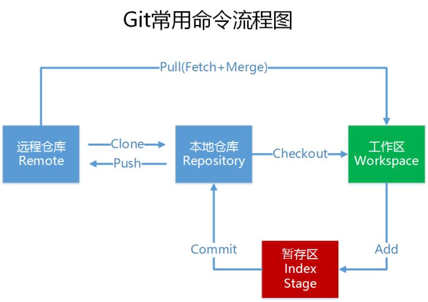

# 项目接口
## 获取所有项目

    1.fgh
    2.sd
    3.fgh

## 获取项目告警


> [hexo添加图片参考](https://blog.csdn.net/sugar_rainbow/article/details/57415705)

```
实践纠错：引用图片的路径不能带与md同名的文件夹，而应该直接引用该目录下资源，因为hexo会自动加上，此时md编辑器中预览不了，而带此级文件夹才可以预览，这点感觉hexo没有做好，可以先带上此级文件夹在md编辑器中预览，发布之前去掉就行了)
```
> 正确的示例
> [插件正确用法](https://github.com/CodeFalling/hexo-asset-image)  


> 首页仍然不能显示图片（需要安装hexo-asset-image之后再创建的文章才能正常显示）
