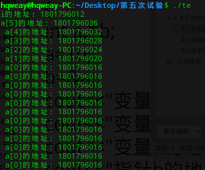
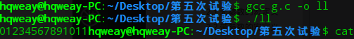

> 1.一段有意思的 C 代码
```
#include<stdio.h>
void fn(){
  int a[5];
  int i;
 printf("i的地址：%d\n", &i);
  for(i=5;i>= -1;i--){
    a[i] = 0;
    printf("a[%d]的地址: %d\n ",i,&a[i] );
  }
}
int main(){
  fn();
  return 0;
}
```
> 2.效果

> [](https://blog.csdn.net/sugar_rainbow/article/details/57415705)



> 3.解释
这里与栈的内存分配有关，在栈里，栈底到栈顶，内存地址是从高到低的。首先给数组 a 分配地址，从高到低 a[5]，a[4]…a[0]，紧跟着给 i 分配内存，所以在内存上看，a[0] 的地址和 i 是连着的，故当越界访问数组 a[-1] 时，实际上访问的是 i 。

如上代码执行 a[-1] = 0; ，实际上执行的 i = 0; 。于是就跳不出 for 循环，产生了上图效果。

> 4.其他
运行环境是 linux。有个小伙伴在服务器上跑，发现一个问题，当上面的代码没有 printf() 来打印 a[i] 的地址时，不会进入循环状态，非常奇怪。

我之前没有 printf() 语句，也没有循环，然后我就想打印出地址查看一下是不是 a[-1] 没访问到 i，结果一执行就进入循环，我便没多想，抱着反正问题复现了，可能之前哪里写错了，那就这样吧的心态休息了…

没想到别人能敏锐地发现这两者之间的关联。致敬，学习。

想起高中的时候生物课上貌似讲过一个发现了一个什么现象但是没有执着去深入研究的生物学家，结果后来这个现象被别人研究并产出了重大的研究成果。

要注意细节呀。

> 5.再来一段
```
#include<stdio.h>
void initialize(){
	int a[12];
	int i;
	for(i=0;i<12;i++){
		a[i] = i;
	}
}
void display(){
	int a[12];
	int i;
	for(i=0;i<12;i++){
		printf("%d", a[i]);
	}
}
int main(){
	initialize();
	display();
	return 0;
}
```
> 效果
 [](https://blog.csdn.net/sugar_rainbow/article/details/57415705)



> 解释
```
理论上第一次调用 initialize()，在栈里给数组分配了一块空间，调用完，该数组所在的空间就被销毁了。调用 display() 时，打印的应该是一些不可预料的值，但是这里却访问到了前一个函数里的东西。

这里涉及到分配内存的方式。首先用户和系统共用一个堆栈指针（SP），调用第一个函数的时候，分配一块内存，sp 向上移动。但是在出函数的时候，所做的操作仅仅是 SP 回到之前的地址，中间的这块内存仍保存为 initialize() 函数执行后的模样。执行 display()，这个函数内申请的变量和前一次函数内的变量一致，变量在内存中的分配形式也一致。分配内存，SP移动，分配的仍是之前那块，初始值就是 initialize() 后的状态。

即便 display() 改为：

void display(){
	int i;
	int a[12];
	...
}

也不会达到上面的效果。
```